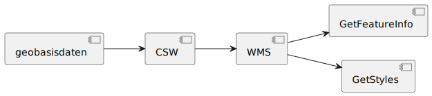
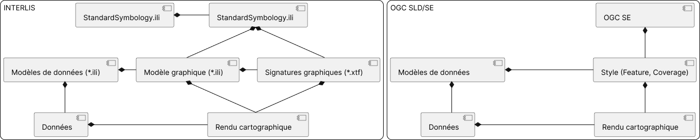
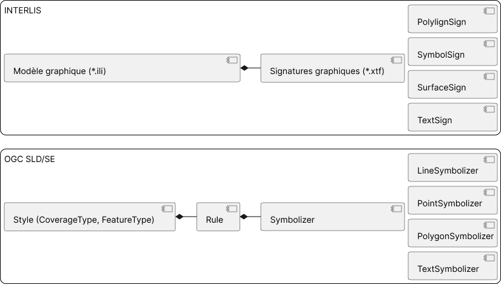
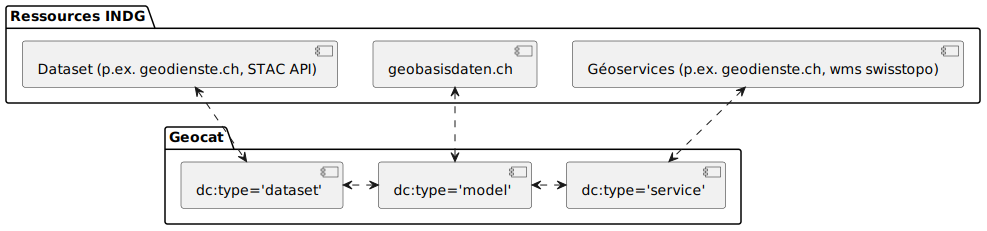

# FGDM4GS

----
## Contexte du projet

- LGéo ([art. 5](https://www.fedlex.admin.ch/eli/cc/2008/388/fr#art_5))et OGéo ( sections [3](https://www.fedlex.admin.ch/eli/cc/2008/389/fr#sec_3) et [4](https://www.fedlex.admin.ch/eli/cc/2008/389/fr#sec_3))
- Modèles de géodonnées minimaux (MGDM)
- Confédération
- Cantons

Note: L'acronyme FGDM4GS signifie "Flat Geodata Models for Geoservices". Ce projet s'inscrit dans le contexte de la LGéo et de l'OGéo qui font mention de modèles de gédonnées minimaux (MGDM) définis par la Confédération que les Cantons se doivent de respecter.

----
## Contexte du projet

<div style="display: flex; align-items: flex-start;">
<div>

- Données & géoservices
- Diversité représentations
- ~~INTERLIS-GML~~ [eCH-0056 4.0](https://www.ech.ch/fr/ech/ech-0056/4.0.0)

</div>
<div>


</div>
</div>

Note: A ajouter plus tard

----
## Objectifs du projet

- Harmonisation de géoservices
    - Dénormalisation de modèles (mise à plat)
    - Définition de `VIEWS`
- Représentation cartographique
- Perspectives & recommendations

Note: Le projet FGDM4GS vise à explorer les possiblités offertes par la définition de `VIEWS` pour harmoniser la publication de géoservices ainsi que les possiblités de représentation cartographique avec INTERLIS. Cela consiste à établir des règles de dénormalisation ou mise à plat des modèles par la définition de `VIEWS`. Il s'agit également de voir comment les modèles de représentation cartographique peuvent être définis avec INTERLIS. Enfin, il s'agit de formuler des perspectives et des recommandations pour l'utilisation d'INTERLIS dans le contexte de la publication de géoservices.

----
## Workplan


Note: A ajouter plus tard

---
## Situation de départ

----
### Dénormalisation (mise à plat)

- `VIEWS`
- Définies à la section [2.15. "Sichten"](https://geostandards-ch.github.io/doc_refhb24/#_sichten) du manuel de référence d'INTERLIS (refhb24).

```interlis
ViewDef = 'VIEW' View-Name
            Properties<ABSTRACT,EXTENDED,FINAL,TRANSIENT>
            [ FormationDef | 'EXTENDS' ViewRef ]
                { BaseExtensionDef }
                { Selection }
            '='
            [ ViewAttributes ]
            { ConstraintDef }
          'END' View-Name ';'.

ViewRef = [ Model-Name '.' [ Topic-Name '.' ] ] View-Name.
``` 

Note: La définition de `VIEWS` est une fonctionnalité d'INTERLIS qui permet de définir des vues sur des modèles de données. Ces vues peuvent être utilisées pour harmoniser la publication de géoservices. Le concept de `VIEWS` est défini dans le manuel de référence d'INTERLIS (refhb24) à la section [2.15. Sichten](https://geostandards-ch.github.io/doc_refhb24/#_sichten). (Nous faisons ici référence à la version allemande du manuel de référence d'INTERLIS (refhb24) car il en existe une version en asciidoc publiée sur le compte GitHub de Geostandards.ch permettant d'en référencer les sections).

----
### Contexte d'utilisation

- Modèles minimaux de géodonnées (MGDM)
    - [geobasisdaten.ch](https://geobasisdaten.ch)
    - [geocat.ch](https://geocat.ch)

Note: Les `VIEWS` pourraient être utilisées pour harmoniser la publication de géoservices. Les MGDM sont des modèles de données définis par la Confédération. Ils sont publiés sur [geobasisdaten.ch](https://geobasisdaten.ch) et [geocat.ch](https://geocat.ch). Il serait intéressant de voir si les `VIEWS` pourraient être utilisées pour harmoniser la publication de géoservices pour ces modèles de données.

----
### Modèle de représentation

- [Portrayal Recommendation for MGDM](https://drive.switch.ch/index.php/apps/onlyoffice/6708010256?filePath=/mediamaps/01-Projets/02-En-cours/01-Flache-Geodatenmodelle/Références/Report_a_1.0.pdf), 2013
- Approche tabulaire
- Très peu utilisée (**3%** des entrées [geobasisdaten.ch](https://geobasisdaten.ch/))

<p align="center">
  
</p>

Note: En 2013, une recommandation a été publiée pour la représentation cartographique des MGDM. Cette recommandation propose une approche tabulaire pour la représentation cartographique. Cette approche est très peu utilisée (3% des entrées [geobasisdaten.ch](https://geobasisdaten.ch/)). Il serait intéressant de poser la question à S.Keller pourquoi l'approche tabulaire a été privilégiée.

---
## Approche proposée

----
### Dénormalisation (mise à plat)

- Sélection de MGDM
- Possibilités de définir des `VIEWS`
- MGDM avec `VIEWS`
- Recommandations
- Pipeline de publication de géoservices?

Note: L'approche proposée consiste à sélectionner des MGDM pour lesquels des `VIEWS` peuvent être définies compte tenu des informations à disposition. Nous nous intéressons ensuite à la manière dont les `VIEWS` peuvent être définies et appliquons le concept aux modèles sélectionnés. Nous formulons des recommandations pour la création de `VIEWS` et explorons finalement la possbilité d'automatier la publication de géoservices.

----
### Modèles de représentation

- Capacités INTERLIS
- Définition de styles basiques
- Application aux MGDM sélectionnés
- Corresponce & Transcoding

Note: Nous nous intéressons en 1er lieu à la manière dont les modèles de représentation cartographique peuvent être définis avec INTERLIS. Nous explorons les possibilités offertes par INTERLIS pour la définition de styles basiques et appliquons le concept aux MGDM sélectionnés. Nous explorons finalement la correspondance entre INTERLIS et les différents langages de description de styles cartographiques ainsi que la possibilité de transcoding entre les différents langages de description de styles cartographiques.

---
## Résultats préliminaires

----
### Sélection de MGDM

- Aspects métiers
    - Jeu de données dénormalisé (ou "à plat")
    - Géoservices
    - Informations de représentation
- Identification des géoservices associés

Note: Aucune vue n'a pu être trouvée dans les MGDM. Ces dernières dépendent d'aspects métiers. Une solution réside dans le fait d'identifier des jeux de données dénormalisés (ou "à plat") ou des géoservices associés de manière à pouvoir les définir.

----
### Sélection de MGDM

- Création `VIEWS`
- Informations de représentation

<p align="center">
  
</p>

Note: Le schéma suivant illustre le concept de sélection de MGDM. Les informations de geobaissdaten.ch sont mises en relation avec les géoservices associés en sollicitant le service CSW (Catalog Service for the Web) de geocat.ch afin d'obtenir les attributs à intégrer dans les `VIEWS`.

----
### Sélection de MGDM

- **347** entrées [geobasisdaten.ch](https://geobasisdaten.ch/) (14.02.2024)
    - **80%** modèle INTERLIS
    - Aucune `VIEWS`
    - **<5%** infos de représentation `.xlsx`
    - **33%** liens géoservices
- Complexité des modèles

Note: [geobasisdaten.ch](https://geobasisdaten.ch/) contenait 347 entrées au 14.02.2023. 80% (283/347) de ces entrées contiennent un lien vers un modèle de données (`.ili`). Aucun modèle ne comporte de `VIEWS`. <5% (~10/347) de ces entrées contiennent un lien vers des informations de représentation au format xlsx. 33% (115/347) de ces entrées ont pu être reliées à des géoservices. Finalement, la complexité des modèles de données a également été prise en compte pour la sélection des modèles de données.

----
### Sélection de MGDM

| Référence | Data Modell   | GetFeatureInfo |
| --------- | ------------- | ---------- |
| [86.1](https://geobasisdaten.ch/detail/992003/)     | [Lien](http://models.geo.admin.ch/ASTRA/Axis_V1_1.ili) | [Lien](https://wms.geo.admin.ch/?SERVICE=WMS&VERSION=1.3.0&REQUEST=GetFeatureInfo&LAYERS=ch.astra.nationalstrassenachsen&QUERY_LAYERS=ch.astra.nationalstrassenachsen&CRS=EPSG:2056&BBOX=2531423.89,1155079.22,2532223.89,1155679.22&FEATURE_COUNT=1&HEIGHT=2&WIDTH=2&FORMAT=image/png&INFO_FORMAT=text/plain&I=1&J=1&lang=fr)|
|[16.1](https://geobasisdaten.ch/detail/990767/), [17.1](https://geobasisdaten.ch/detail/990822/)| [Lien](https://models.geo.admin.ch/ASTRA/IVS_V2_1.ili)|[Lien](https://wms.geo.admin.ch/?SERVICE=WMS&VERSION=1.3.0&REQUEST=GetFeatureInfo&LAYERS=ch.astra.ivs-nat&QUERY_LAYERS=ch.astra.ivs-nat&CRS=EPSG:2056&BBOX=2531423.89,1155079.22,2532223.89,1155679.22&FEATURE_COUNT=1&HEIGHT=2&WIDTH=2&FORMAT=image/png&INFO_FORMAT=text/xml&I=1&J=1)|
| [76.1](https://geobasisdaten.ch/detail/989814/) | [Lien](https://models.geo.admin.ch/ARE/Zones_reservees_V1_1.ili)  | [Lien](https://geodienste.ch/db/planungszonen_v1_0_0/fra?SERVICE=WMS&VERSION=1.3.0&REQUEST=GetFeatureInfo&CRS=EPSG:3857&BBOX=742465.67788010137155652,5902893.5199219873175025,751489.7654410689137876,5913919.95374835748225451&WIDTH=667&HEIGHT=815&LAYERS=planungszone&FORMAT=image/png&QUERY_LAYERS=planungszone&INFO_FORMAT=application/vnd.ogc.gml&I=500&J=267&FEATURE_COUNT=1) |
| [72.1](https://geobasisdaten.ch/detail/819137/) | [Lien](https://models.geo.admin.ch/ASTRA/SectoralPlanForRoadInfrastructure_V1_4.ili) | [Lien](https://wms.geo.admin.ch/?SERVICE=WMS&VERSION=1.3.0&REQUEST=GetFeatureInfo&LAYERS=ch.astra.sachplan-infrastruktur-strasse_kraft&QUERY_LAYERS=ch.astra.sachplan-infrastruktur-strasse_kraft&CRS=EPSG:2056&BBOX=2531423.89,1155079.22,2532223.89,1155679.22&FEATURE_COUNT=1&HEIGHT=2&WIDTH=2&FORMAT=image/png&INFO_FORMAT=text/plain&I=1&J=1) |

Note: Nous avons sélectionné les modèles de données suivants pour lesquels des `VIEWS` peuvent être définies compte tenu des géoservices associés ainsi qu'en fonction de leur complexité.

----
### Définition de `VIEWS`

- `PROJECTION OF`
- `JOIN OF` & `WHERE`
- `UNION OF`
- `AGGREGATION OF`
- `INSPECTION OF`

Note: Il existe **5** possibilités pour définir des `VIEWS` en INTERLIS. Elles seront présentés dans les sides suivantes.

----
#### `PROJECTION OF`

```interlis
INTERLIS 2.3;
CONTRACTED MODEL Test  AT "http://www.interlis.ch/ili2c/tests/" VERSION "1"=
  FUNCTION makeConstant(text : TEXT):TEXT;
  TOPIC Base = 
    STRUCTURE A =
      Attr1: TEXT*20;
    END A;
    CLASS B =
      Attr1: TEXT*20;
      Attr2: BAG OF A;
    UNIQUE
      Attr1;
    END B;
  END Base;
  TOPIC ViewProjection =
    DEPENDS ON Test.Base;
    VIEW VB PROJECTION OF Test.Base.B;
	 =
      ATTRIBUTE
        ALL OF B;
        Attr3 : TEXT*80 := makeConstant("hello World");
    END VB;
  END ViewProjection;
END Test.
```

Lien vers le [modèle](https://github.com/claeis/ili2c/blob/c506ae466333d726b885ca7fae4ce6825e94176d/test/data/ili23/view/view_AcceptBasicViewProjectionDef.ili)

Note: Selon le manuel de référence (refhb24), la vue projection (mot-clé PROJECTION OF) constitue la vue la plus simple. Elle permet de visualiser la classe de base (classe, structure, association ou vue) sous une forme modifiée (affichage d’une partie seulement des attributs et selon un ordre modifié, par exemple).

----
#### `JOIN OF` & `WHERE`

```interlis
INTERLIS 2.3;

MODEL Test  AT "http://www.interlis.ch/ili2c/tests/" VERSION "1"=

  TOPIC Base = 

    CLASS B =
      Attr1: TEXT*20;
      Attr2: TEXT*10;
    END B;

    CLASS C =
      Attr3: TEXT*30;
    END C;

  END Base;

  TOPIC Join =

    DEPENDS ON Test.Base;

    VIEW BC
      JOIN OF B ~ Test.Base.B,C ~ Test.Base.C (OR NULL);
      WHERE B->Attr1 == C->Attr3;
	=
      ATTRIBUTE
        ALL OF B;
        ALL OF C;
    END BC;

  END Join;

END Test.
```

Lien vers le [modèle](https://github.com/claeis/ili2c/blob/c506ae466333d726b885ca7fae4ce6825e94176d/test/data/ili23/view/view_AcceptBasicJoinDef.ili)

Note: Selon le manuel de référence (refhb24), la vue jonction (mot-clé JOIN OF) permet de former le produit cartésien (ou produit vectoriel) des classes de base (classe ou vue), c.-à-d. qu’il existe alors autant d’objets de la classe de jonction que de combinaisons d’objets des différentes classes de base. Le fait de lui associer une clause `WHERE` permet de définir les champs de jonction.

----
#### `UNION OF`

```interlis
INTERLIS 2.3;
MODEL Test  AT "http://www.interlis.ch/ili2c/tests/" VERSION "1"=
  TOPIC Base = 
    CLASS C1 =
      Attr1: TEXT*10;
    END C1;
    CLASS C2 =
      Attr2: TEXT*30;
    END C2;
  END Base;
  TOPIC Union =
    DEPENDS ON Test.Base;
    VIEW CC 
      UNION OF C1 ~ Test.Base.C1,C2 ~ Test.Base.C2;
	=
      ATTRIBUTE
        Attr1 : TEXT*30 := C1->Attr1,C2->Attr2;
    END CC;
  END Union;
END Test.
```

Lien vers le [modèle](https://github.com/claeis/ili2c/blob/c506ae466333d726b885ca7fae4ce6825e94176d/test/data/ili23/view/view_AcceptBasicUnionDef.ili)

Note: Selon le manuel de référence (refhb24), la vue union (mot-clé UNION OF) permet la fusion de différentes classes de base en une classe unique. Les attributs des différentes classes de base sont généralement affectés à un attribut de la vue union. Le type d’attribut de la classe de base doit être compatible avec celui de la vue union (même type ou extension de celui-ci).


----
#### `AGGREGATION OF`

```interlis
INTERLIS 2.3;
CONTRACTED MODEL Test  AT "http://www.interlis.ch/ili2c/tests/" VERSION "1"=
  TOPIC Base = 
    CLASS B =
      Attr1: TEXT*20;
    END B;
  END Base;
  FUNCTION countB(elements : BAG OF Test.Base.B):NUMERIC;
  TOPIC Aggregation =
    DEPENDS ON Test.Base;
    VIEW VB2 
      AGGREGATION OF Test.Base.B  EQUAL(B->Attr1);
	=
      ATTRIBUTE
        ElementCount : 0 .. 10000 := countB(AGGREGATES);
    END VB2;
  END Aggregation;
END Test.
```

Lien vers le [modèle](https://github.com/claeis/ili2c/blob/c506ae466333d726b885ca7fae4ce6825e94176d/test/data/ili23/view/view_AcceptBasicAggregationDef.ili)

Note: Selon le manuel de référence (refhb24), la vue agrégation (mot-clé AGGREGATION OF) permet de regrouper, en une même instance, toutes les instances d’un ensemble de base ou celles présentant une identité avec la combinaison d’attributs requise.

----
#### `INSPECTION OF`

```interlis
INTERLIS 2.3;
MODEL Test AT "http://www.interlis.ch/ili2c/tests/" VERSION "1" =
  TOPIC Base = 
    STRUCTURE A =
      Attr1: TEXT*20;
    END A;
    CLASS B =
      Attr2: BAG OF A;
    END B;
    VIEW VB 
      INSPECTION OF Test.Base.B->Attr2;
	=
      ATTRIBUTE
      Attr1: TEXT*20 := B->Attr1;
    END VB;
  END Base;
END Test.
```

Lien vers le [modèle](https://github.com/claeis/ili2c/blob/c506ae466333d726b885ca7fae4ce6825e94176d/test/data/ili23/view/view_AcceptBasenameOfUnrenamedInspectionDef.ili)

Note: Selon le manuel de référence (refhb24), la vue inspection (mot-clé INSPECTION OF) permet d’obtenir l’ensemble de tous les éléments structurés (définis via BAG OF, LIST OF ou dans le respect d’une ligne, d’une surface simple ou d’une partition d’un territoire) appartenant à un attribut de sous-structure (direct ou indirect) d’une classe d’objets.

----
### Exemple MGDM #1

```interlis
INTERLIS 2.3;
MODEL Axis_LV95_V1_1_d (en)
  AT "mailto:maxime.collombin@heig-vd.ch"
  VERSION "2023-12-06" =
    IMPORTS Axis_LV95_V1_1;
    TOPIC Axis_d EXTENDS Axis_LV95_V1_1.Axis =
      VIEW view_Axis
        JOIN OF Axis_LV95_V1_1.Axis.Axis, Axis_LV95_V1_1.Axis.AxisSegment, Axis_LV95_V1_1.Axis.Sector;
        WHERE
          Axis->rAxisSegment == AxisSegment
          AND
          AxisSegment->rLinearReference == Sector; 
          =
        ATTRIBUTE
          wkb_geometry := AxisSegment -> Geometry;
          Eigenumer := Axis -> Owner;
          Segmentname := AxisSegment -> SegmentName;
          Strassennummer := Axis -> AxisName;
          Bezeichnung := Axis -> AxisNameLong;
          Positionscode := Axis -> AxisPositionCode;
          Bezugspunkt_Name := Sector -> SectorName;
          Kilometerwert_km := Sector -> Km;
          Sektorlange_m := Sector -> SectorLength;
          Sequenz := Sector -> Sequence;
      END view_Axis;
    END Axis_d;
END   Axis_LV95_V1_1_d.
```

Note: Les exemples de `VIEWS` pour les modèles de données sélectionnés ont été définis en INTERLIS. Ces exemples illustrent les possibilités offertes par INTERLIS pour la définition de `VIEWS`. Les `VIEWS` ont été définies pour les modèles de données suivants: Axis_LV95_V1_1, IVS_V2_1, Planungszonen_V1_1 et BaseModel_SectoralPlans_LV95_V1_4.

----
### Exemple MGDM #2

```interlis
INTERLIS 2.3;
MODEL IVS_V2_1_d
AT "mailto:maxime.collombin@heig-vd.ch"
VERSION "2023-12-04" = 
    IMPORTS IVS_V2_1;
    TOPIC IVS_Ik_d EXTENDS IVS_V2_1.IVS_Inventarkarte =
        VIEW view_ivs
            JOIN OF IVS_V2_1.IVS_Inventarkarte.ivs_linienobjekte_base, IVS_V2_1.IVS_Inventarkarte.ivs_linienobjekte_lv95, IVS_V2_1.IVS_Inventarkarte.ivs_objekte, IVS_V2_1.IVS_Inventarkarte.ivs_signatur_linie, IVS_V2_1.IVS_Inventarkarte.ivs_kantone, IVS_V2_1.IVS_Inventarkarte.ivs_streckenbeschriebe, IVS_V2_1.IVS_Inventarkarte.ivs_slanamen;
            WHERE
                ivs_slanamen->Role_ivs_objekte == ivs_linienobjekte_base
                AND
                ivs_objekte->Role_ivs_kantone == ivs_kantone
                AND
                ivs_streckenbeschriebe->Role_ivs_objekte == ivs_objekte
                AND
                ivs_linienobjekte_base->Role_ivs_signatur_linie == ivs_signatur_linie
                AND
                ivs_linienobjekte_base->Role_ivs_objekte == ivs_objekte;
                =
            ATTRIBUTE
                wkb_geometry := ivs_linienobjekte_lv95 -> ivs_geometrie;
                ivs_nummer := ivs_objekte -> ivs_nummer;
                ivs_signatur_label := ivs_signatur_linie -> ivs_deutsch;
                ivs_kanton := ivs_kantone -> ivs_kanton;
                ivs_sladatehist := ivs_streckenbeschriebe -> ivs_sladatehist;
                ivs_sladatemorph := ivs_streckenbeschriebe -> ivs_sladatemorph;
                ivs_slabedeutung := ivs_objekte -> ivs_slabedeutung;
                ivs_sortsla := ivs_objekte -> ivs_sortsla;
                ivs_slaname := ivs_slanamen -> ivs_slaname;
        END view_ivs;
    END IVS_Ik_d;
END IVS_V2_1_d.
```

Note: Les exemples de `VIEWS` pour les modèles de données sélectionnés ont été définis en INTERLIS. Ces exemples illustrent les possibilités offertes par INTERLIS pour la définition de `VIEWS`. Les `VIEWS` ont été définies pour les modèles de données suivants: Axis_LV95_V1_1, IVS_V2_1, Planungszonen_V1_1 et BaseModel_SectoralPlans_LV95_V1_4.

----
### Exemple MGDM #3

```interlis
INTERLIS 2.3;
MODEL Planungszonen_V1_1_d_A
AT "mailto:maxime.collombin@heig-vd.ch"
VERSION "2023-12-04" =
    IMPORTS Planungszonen_V1_1;
    TOPIC PZ_d EXTENDS Planungszonen_V1_1.Geobasisdaten =
      VIEW view_pz
        JOIN OF Planungszonen_V1_1.Geobasisdaten.Planungszone, Planungszonen_V1_1.Geobasisdaten.Typ_Planungszone; 
        WHERE 
           Planungszone->TypPZ == Typ_Planungszone;
           =
        ATTRIBUTE
         wkb_geometry := Planungszone -> Geometrie;
         publiziert_ab := Planungszone -> publiziertAb;
         gueltig_bis := Planungszone -> publiziertBis;
         rechtsstatus := Planungszone -> Rechtsstatus;
         bemerkungen := Planungszone -> Bemerkungen;
         code_typ := Typ_Planungszone -> Code;
         bezeichnung_typ := Typ_Planungszone -> Bezeichnung;
         abkuerzung_typ := Typ_Planungszone -> Abkuerzung;
         festlegung_stufe_typ := Typ_Planungszone -> Festlegung_Stufe;
         bemerkung_typ := Typ_Planungszone -> Bemerkungen;
      END view_pz;
    END PZ_d;
END Planungszonen_V1_1_d_A.
```

Note: Les exemples de `VIEWS` pour les modèles de données sélectionnés ont été définis en INTERLIS. Ces exemples illustrent les possibilités offertes par INTERLIS pour la définition de `VIEWS`. Les `VIEWS` ont été définies pour les modèles de données suivants: Axis_LV95_V1_1, IVS_V2_1, Planungszonen_V1_1 et BaseModel_SectoralPlans_LV95_V1_4.

----
### Exemple MGDM #3bis

```interlis
INTERLIS 2.3;
MODEL Planungszonen_V1_1_d_B
AT "mailto:maxime.collombin@heig-vd.ch"
VERSION "2023-12-04" =
    IMPORTS Planungszonen_V1_1;
    TOPIC PZ_d EXTENDS Planungszonen_V1_1.Geobasisdaten =
      VIEW view_pz 
        PROJECTION OF TypPZ_Planungszone;
           =
        ATTRIBUTE
         wkb_geometry := TypPZ_Planungszone -> Planungszone -> Geometrie;
         publiziert_ab := TypPZ_Planungszone -> Planungszone -> publiziertAb;
         gueltig_bis := TypPZ_Planungszone -> Planungszone -> publiziertBis;
         rechtsstatus := TypPZ_Planungszone -> Planungszone -> Rechtsstatus;
         bemerkungen :=  TypPZ_Planungszone -> Planungszone -> Bemerkungen;
         code_typ := TypPZ_Planungszone -> TypPZ -> Code;
         bezeichnung_typ := TypPZ_Planungszone -> TypPZ -> Bezeichnung;
         abkuerzung_typ := TypPZ_Planungszone -> TypPZ -> Abkuerzung;
         festlegung_stufe_typ := TypPZ_Planungszone -> TypPZ -> Festlegung_Stufe;
         bemerkung_typ := TypPZ_Planungszone -> TypPZ -> Bemerkungen;
      END view_pz;
    END PZ_d;
END Planungszonen_V1_1_d_B.
```

Note: Les exemples de `VIEWS` pour les modèles de données sélectionnés ont été définis en INTERLIS. Ces exemples illustrent les possibilités offertes par INTERLIS pour la définition de `VIEWS`. Les `VIEWS` ont été définies pour les modèles de données suivants: Axis_LV95_V1_1, IVS_V2_1, Planungszonen_V1_1 et BaseModel_SectoralPlans_LV95_V1_4.

----
### Exemple MGDM #4

```interlis
INTERLIS 2.3;
MODEL BaseModel_SectoralPlans_LV95_V1_4_d
AT "mailto:maxime.collombin@heig-vd.ch"
VERSION "2023-12-17" =
    IMPORTS BaseModel_SectoralPlans_LV95_V1_4, BaseModel_SectoralPlans_Catalogues_V1_4;
        TOPIC SPRI_d =
        DEPENDS ON BaseModel_SectoralPlans_Catalogues_V1_4.Catalogue_FacilityStatus;
        DEPENDS ON BaseModel_SectoralPlans_LV95_V1_4.SectoralPlans_WithLatestModification;
        DEPENDS ON BaseModel_SectoralPlans_Catalogues_V1_4.Catalogue_FacilityKind;
            VIEW view_sri
                JOIN OF 
                    BaseModel_SectoralPlans_LV95_V1_4.SectoralPlans_WithLatestModification.Facility,
                    BaseModel_SectoralPlans_Catalogues_V1_4.Catalogue_FacilityStatus.FacilityStatus,
                    BaseModel_SectoralPlans_Catalogues_V1_4.Catalogue_FacilityKind.FacilityKind,
                    BaseModel_SectoralPlans_LV95_V1_4.SectoralPlans_WithLatestModification.Object,
                    BaseModel_SectoralPlans_LV95_V1_4.SectoralPlans_WithLatestModification.Document;
                WHERE
                    Facility->Object == Object
                    AND
                    Document->Object == Object;
                    =
                ATTRIBUTE
                wkb_geometry := Facility -> Point;
                !! wkb_geometry := Facility -> Line;           !! other option for the geometry 
                !! wkb_geometry := Facility -> Surface;        !! other option for the geometry 
                facname := Facility -> Name;
                facstatus_tid := FacilityStatus -> StatusID;
                facstatus_text := FacilityStatus -> Name;
                fackind_tid := FacilityKind -> KindID;
                fackind_text := FacilityKind -> Name;
                description := Facility -> Description;        !! this attribute is ambiguous
                objname := Object -> Name;
                validfrom := Document -> ModInfo;              !! this attribute is ambiguous; only the attribute validfrom is needed; this definition is proably wrong
                doc_title := Document -> Title;
                doc_web := Document -> Web;
            END view_sri;
        END SPRI_d; 
END BaseModel_SectoralPlans_LV95_V1_4_d.
```

Note: Les exemples de `VIEWS` pour les modèles de données sélectionnés ont été définis en INTERLIS. Ces exemples illustrent les possibilités offertes par INTERLIS pour la définition de `VIEWS`. Les `VIEWS` ont été définies pour les modèles de données suivants: Axis_LV95_V1_1, IVS_V2_1, Planungszonen_V1_1 et BaseModel_SectoralPlans_LV95_V1_4.

----
### Premières conclusions

- Aucune `VIEWS` dans les MGDM
- Utilisation de modèles dérivés
- `VIEWS` non prise en charge par ili2db
- `PROJECTION OF` <Association>
    - pas de clause `WHERE`
    - limitation à une seule Association
- `JOIN OF` & `WHERE`

Note: Aucune `VIEWS` n'a pu être trouvée dans les MGDM. Nous recommandoans la création de modèles dérivés pour la définition de `VIEWS` à des fins de publication de géoservices, ce, afin de ne pas altérer les modèles de bases. La méthode la plus simple est la vue projection (mot-clé PROJECTION OF) sur la base d’une association. Elle est cependant limitée à une association. La vue join (mot-clé JOIN OF) associée à la clause where (mot-clé WHERE) est une alternative pour les cas plus complexes. Il serait important que ili2db prenne en charge les `VIEWS` pour faciliter la publication de géoservices.

----
### Modèles de représentation

- Comparaison des modèles conceptuels
- Correspondance INTERLIS, OGC [SLD/SE](https://www.ogc.org/standard/se/), [SymCore](https://opengeospatial.github.io/ogcna-auto-review/18-067r4.html)



Note: INTERLIS définit un modèle graphique (`.ili`) et une signature graphique (`.xtf`). La signature graphique (`.ili`) est liée au modèle graphique (`.xtf`) lui même lié au Modèle de données. L'association du modèle graphique, des signatures graphiques et des données permettent le rendu cartographique. Le standard OGC SLD/SE définit deux types de styles cartographiques: `FeatureTypeStyle` et `CoverageStyle`. Le `FeatureTypeStyle` est utilisé pour définir le style d'une couche vecteur tandis que le `CoverageStyle` est utilisé pour définir le style d'une couche raster. La représenation Raster n'étant pour l'heure pas prise en charge par INTERLIS, nous nous intéressons en 1er lieu au `FeatureTypeStyle`. L'association d'un `FeatureTypeStyle` à des données permet le rendu cartographique.

----
### INTERLIS vs. SLD/SE

- Modèle Graphique ~ Style + Rule (Filter)
- Signature Graphique ~ Symbolizer

<p align="center">
  
</p>

Note: Dans le contexte d'INTERLIS, la signature graphique (`.xtf`) est composée de 0 à n symboles de type ligne (`PolylineSign`), point (`SymbolSign`), surface (`SurfaceSign`) ou texte (`TextSign`).  Dans le contexte d'OGC SLD/SE Un `FeatureTypeStyle` est composé d'une ou de plusieures règles (`Rule`) elles-mêmes composés de 0 à n filtres (`Filter`) et de 0 à n symboliseurs (`Symbolizer`). Les symboliseurs peuvent être de type Ligne (`LineSymbolizer`), Point (`PointSymbolizer`), Polygon (`PolygonSymbolizer`) ou Texte (`TextSymbolizer`).

----
### INTERLIS vs. SLD/SE
#### PolylineSign/LineSymbolizer

----
### INTERLIS vs. SLD/SE
#### SymbolSign/PointSymbolizer

----
### INTERLIS vs. SLD/SE
#### SurfaceSign/PolygonSymbolizer

----
### INTERLIS vs. SLD/SE
#### TextSign/TextSymbolizer

---
### Perspectives
#### (Dénormalistion)

- Automatisation de la création de `VIEWS`
- Pipeline de publication
  - POC [ldproxy](https://github.com/interactive-instruments/ldproxy)
  - [OGC API - Features - Part 5: Schemas](https://docs.ogc.org/DRAFTS/23-058.html)

Note: Dans le cas de modèles existants pour lesquels des géoservices ont pu être identifiés, il serait intéressant d'explorer la possibilité d'automatiser la création de `VIEWS`. Il serait également intéressant de voir comment les `VIEWS` pourraient être intégrées dans un pipeline de publication de géoservices. Un POC avec ldproxy pourrait être intéressant à cet égard. Il serait également intéressant de comparer les `VIEWS` avec les schémas obtenus à partir d'implémentations de la spécification OGC API - Features - Part 5: Schemas.

----
### Perspectives
#### (Modèle de représentation)

- Mapping INTERLIS, OGC SLD/SE & SymCore
- Style Editor (p.ex. [GeoStyler](https://geostyler.org/) ou ~ [pySLD](https://github.com/iamtekson/pySLD))
- Transcoding (p.ex. [GeoStyler](https://github.com/geostyler/geostyler) ou [bridge-style](https://github.com/GeoCat/bridge-style))
- INTERLIS <-> OGC SLD/SE & SymCore encodings
  - Modèle données, modèle & signature graphique

Note: Pour favoriser l'interopéralité entre INTERLIS et les autres langages de description de styles cartographiques, il s'agit en premier lieu de créer un mapping entre INTERLIS, OGC SE & SymCore. Cela afin de pouvoir intégrer INTERLIS à un convertisseur de styles cartographiques (p.ex. GeoStyler, bridge-style) ou à un éditeur de style cartographique (p.ex. GeoStyler, ou à un équivalent de pySLD). Finalement, afin de pouvoir convertir des feuilles de style vers le modèle et la signature graphique INTERLIS, il semble nécessaire de devoir recourir au modèle de données INTERLIS associé.

---
### Recommendations
#### (Dénormalisation)

- Création de modèles dérivés
- `PROJECTION OF` <Association>
- `JOIN OF` & `WHERE`
- Prise en charge des `VIEWS` par ili2db

Note: Nous recommandons la création de modèles dérivés pour la définition de `VIEWS` à des fins de publication de géoservices, ce, afin de ne pas altérer les modèles de bases. La méthode la plus simple est la vue projection (mot-clé PROJECTION OF) sur la base d’une association. Elle est cependant limitée à une association. La vue join (mot-clé JOIN OF) associée à la clause where (mot-clé WHERE) est une alternative pour les cas plus complexes. Il serait important que ili2db prenne en charge les `VIEWS` pour faciliter la publication de géoservices.

----
### Recommendations
#### (Dénormalisation)

- Modifier le code source de [ili2db](https://github.com/claeis/ili2db) pour la prise en charge des `VIEWS`
- [Python Bindings für INTERLIS](https://interlis.discourse.group/t/python-bindings-fuer-interlis/203)
    - Prise en charge des `VIEWS`

Note: Il serait intéressant de modifier le code source de ili2db pour la prise en charge des `VIEWS`. Si un python binding pour INTERLIS devait être développé (cf [discussion](https://interlis.discourse.group/t/python-bindings-fuer-interlis/203)), il serait intéressant de voir si les `VIEWS` pourraient être prises en charge. La ressource [pg2ili](https://github.com/gacarrillor/pg2ili) pourrait également être intéressante à explorer.

----
### Recommendations
#### (Inventaires des MGDM)

- Intégrer des liens entre les différentes ressources (geobasisdaten.ch, geocat.ch, WMS, WFS etc.)
- Màj geobasisdaten.ch liens geocat.ch [type='model'](https://www.geocat.ch/geonetwork/srv/fre/csw?service=CSW&version=2.0.2&request=GetRecords&resultType=results&constraintLanguage=CQL_TEXT&constraint=dc:type='model'&constraint_language_version=1.1.0&typeNames=csw:Record)
- Liens entres `dc:type` de geocat.ch ([model](https://www.geocat.ch/geonetwork/srv/fre/csw?service=CSW&version=2.0.2&request=GetRecords&resultType=results&constraintLanguage=CQL_TEXT&constraint=dc:type='model'&constraint_language_version=1.1.0&typeNames=csw:Record), [service](https://www.geocat.ch/geonetwork/srv/fre/csw?service=CSW&version=2.0.2&request=GetRecords&resultType=results&constraintLanguage=CQL_TEXT&constraint=dc:type='service'&constraint_language_version=1.1.0&typeNames=csw:Record), [dataset](https://www.geocat.ch/geonetwork/srv/fre/csw?service=CSW&version=2.0.2&request=GetRecords&resultType=results&constraintLanguage=CQL_TEXT&constraint=dc:type='dataset'&constraint_language_version=1.1.0&typeNames=csw:Record))

Note: Il serait intéressant d'intégrer des liens entre les différentes ressources (geobasisdaten.ch, geocat.ch, WMS, WFS etc.) pour faciliter la navigation entre ces ressources. Cela est tout particulièrement vrai pour geocat qui distingue les modèles de données des géoservices et des datasets pour lesquels il n'existe pas de lien interne.

----
### Recommendations
#### (Mise en réseau des ressources)



- [geocat.ch](https://www.geocat.ch/geonetwork/srv/eng/catalog.search#/home) `type='model'` & [geobasisdaten](https://geobasisdaten.ch) ➡ `type='service'`
- [geobasisdaten.ch](https://geobasisdaten.ch) ➡ [geocat.ch]((https://www.geocat.ch/geonetwork/srv/eng/catalog.search#/home)) `type='model'`

Note: Il serait intéressant de mettre en réseau les ressources INDG (geobasisdaten.ch, geocat.ch, WMS, WFS etc.) pour faciliter la navigation entre ces ressources. Cela est tout particulièrement vrai pour geocat.ch qui distingue les modèles de données des géoservices et des datasets pour lesquels il n'existe pas de lien interne. Une première étape consisterait à récuperer les références MGDM au niveau des enregistrements correspondants aux modèles sur geocat.ch. On obtiendrait ainsi une correspondance entre les modèles de données et les géoservices permettant d'ajouter des liens entre les deux ressources. Les liens pourraient finalement être mis à jour sur geobasisdaten.ch afin de référencer les modèles et non plus les services. Une démarche similaire pourrait être envisagée pour les autres ressources. Il est également à noter seuls le contexte des MGDM et de geobasisdaten.ch a été pris en compte. D'autres ressources tels que [models.geo.admin.ch](https://models.geo.admin.ch/) ou d'autres model repository pourraient également être pris en compte.

----
### Recommendations
#### (Collection(s) de Styles)


- Publication de collection(s) de styles

Note: Il serait intéressant de publier des collections de styles afin de favoriser leur réutilisation ainsi que l'harmonisation des représentations cartographiques des géoservices publiés. Une implémentation de la spécification OGC API - Styles pourrait être envisagée à cet égard.